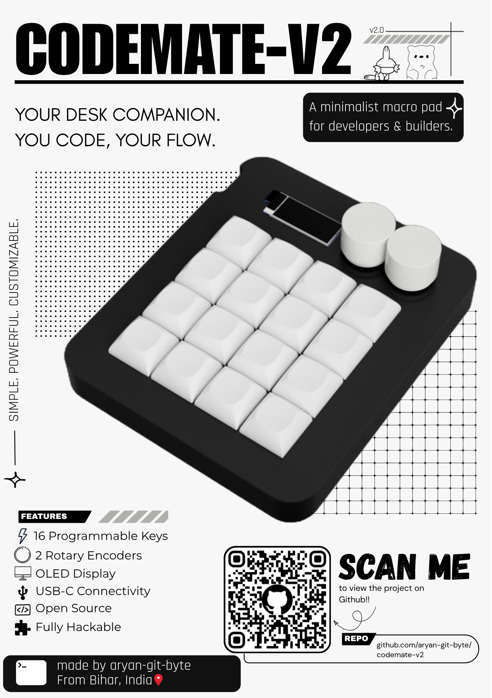
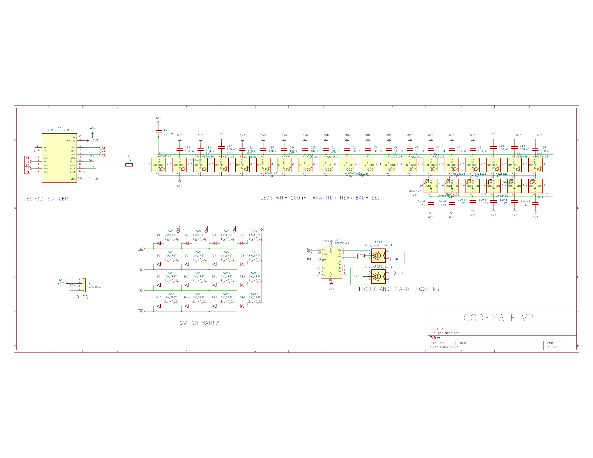
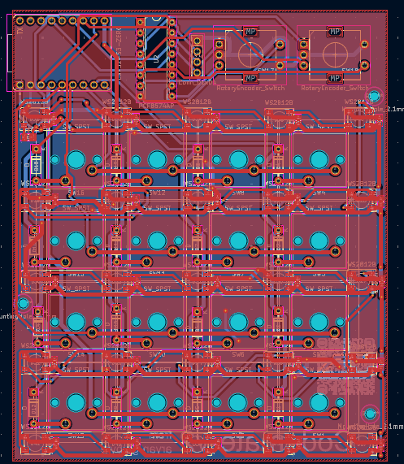
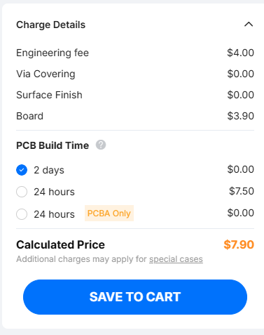

# Overview:

# What is this??
Yo, this is a 4x4 custom macropad that you can use for making ur life ezz, lol
it has 16 macros, 2 rotary encoders, RGB lights and an OLED display. and also it is a successor of my previous macropad [Codemate](https://github.com/aryan-git-byte/codemate).
# Use case:
whether you are a programmer, 3d modeller, editor or whatever u can easily use this macropad with just a little bit tweak in its firmware.
# Schematic Overview:
this is the schematic of the project, which u can see here:

you can see the MCU, the key matrix, the LEDs, encoders, everything in this schematic.

# PCB overview:
for this i am using a 2 layer pcb board:

# How to Assemble
1. get the pcb ordered and solder all the components to it carefully
2. get these things 3d printed:
    1. [top-plate](3D-models/printable/TopPanel.stl) - 1x
    2. [main-body](3D-models/printable/Main-Body.stl) - 1x
    3. [keycaps](<3D-models/printable/DSA 1u.step>) - 16x
    4. [encoders](3D-models/printable/EncoderKnob.step) - 2x
3. cover it with the top plate
4. drill a 2 mm hole near the red holes:

5. insert 4 m3 inserts in these holes on the main body.
6. Now, put the soldered pcb with all the components inside the main-body
7. put the top panel , and put m3 screws. 
8. now put the keycaps and the knob onto it.
9. enjoy <3

# BOM:
|item name | quantity | unit price | link | total price
|-|-|-|-|-
Esp32-s3 zero development board|1| 620 rs | [link](https://hubtronics.in/esp32-s3-zero-m?srsltid=AfmBOoq3kT32v8UczG0TNtBfSk1mz6VMTDCRHNpQfM2GaU1SiqyRmEIawpQ)| 620 rs 
Blue MX cherry switches ( pack of 10)| 2 | 350 rs | [link](https://meckeys.com/shop/accessories/keyboard-accessories/key-switches/cherry-mx2a-switch/)| 700 rs
Oled 0.91"|1|198 rs |[link](https://hubtronics.in/0.91inch-4pin-oled-display-module?srsltid=AfmBOookZKpAjyAl9gw9jcReCTK7EAOUjZujy9mtLwreZrFGmea6Y7Tw4Bo)|198 rs 
PCF8574AP | 1 | 124 rs | [link](https://robu.in/product/pcf8574an-texas-instruments-pcf8574an-i-o-expander-8-bit-i2c-2-5-v-6-v-dip-16-pins/)|128 rs
EC11 rotary encoder|2|64 rs | [link](https://www.flyrobo.in/15mm-ec11-rotary-encoder-with-switch-digital-potentiometer?tracking=ads&srsltid=AfmBOoolmlw6qAxzYU2i8ZVPycIOWE9vltP8OnFKiRVbvLtu4q_V_7MlLQc) | 128 rs 
WS2812B | 40 | 4.72 rs | [link](https://hubtronics.in/ws2812b-5050-led?srsltid=AfmBOopNwODVwO3OMV0OqoXZXVZTHtyzRN5Mug-3Q1g00d0sAzbv55LT4r4)| 188.80 rs
470 ohm 0805 resistor (pack of 20)| 1| 8 rs | [link](https://quartzcomponents.com/products/470ohm-470e-5-smd-resistor-0805-pack-of-20-pieces?variant=43515854749930&country=IN&currency=INR&utm_medium=product_sync&utm_source=google&utm_content=sag_organic&utm_campaign=sag_organic&srsltid=AfmBOop0LmdszysC6QKr0nqkLmwG5YoMJAUPzzIZ7T8eKz9CffIsIlRdmUY)|8 rs
100 nF Capacitor 0603 (pack of 20)|2|11 rs | [link](https://quartzcomponents.com/products/kemet-100nf-50v-0603-smd-pack-x7r-multilayer-ceramic-capacitor-10-tolerence-pack-of-20?variant=45972486193386&country=IN&currency=INR&utm_medium=product_sync&utm_source=google&utm_content=sag_organic&utm_campaign=sag_organic&srsltid=AfmBOopnfKv3gKdibyX3qxzEoiDa6hgtUaGOK5H7Lh-MDVl_BFFMZAF-OTY)| 22 rs
 Diode (1N4148)|25|3 rs |[link](https://quartzcomponents.com/products/1n4148-zener-diode?variant=42817413546218&country=IN&currency=INR&utm_medium=product_sync&utm_source=google&utm_content=sag_organic&utm_campaign=sag_organic&srsltid=AfmBOooP8why-3JDRTveRI7fR_9TvlunJk5nlbo3Xbwx15PTjlmVHmHTaeQ)|75 rs
hubtroncs shipping charge| 1 | 75 rs | | 75 rs 
Meckkeys shipping charge | 1 | 100 rs | | 100 rs
FlyRobo shipping | 1 | 59 rs | | 59 rs 

[ Note: the components from the quartz component and robu are budled with my other order of different project, otherwise if u are ordering it for yourself , it will be 100 rs each ]

Total: 2301 rs , (24 usd)

## PCB will be :   
        

7 usd, shipping will be another 10 usd, but i m getting this shipped along with my different pcb.

# grand total : 31 usd